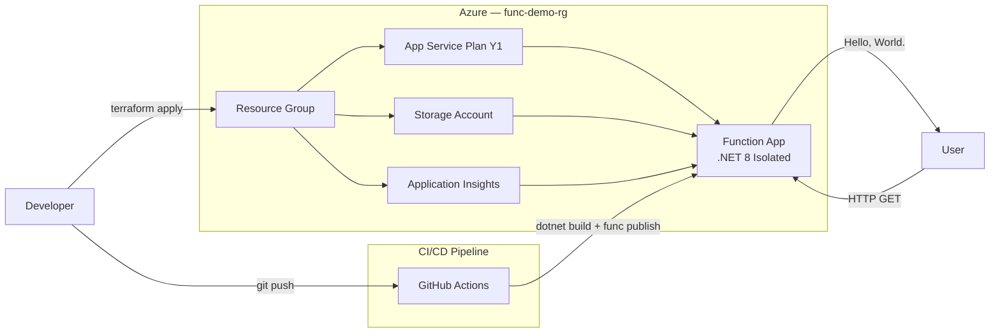

# Azure Function App — Terraform Deployment

> Serverless Hello World HTTP function deployed on Azure using Terraform,
> Azure Functions Core Tools, and automated via GitHub Actions CI/CD pipeline.

## Overview

This project provisions the infrastructure and deploys a sample HTTP-triggered
Azure Function using Terraform and the AzureRM provider. The function responds
to HTTP GET requests and returns a "Hello, World." response.

The infrastructure is defined as code using Terraform, ensuring repeatable and
consistent deployments. Function code can be deployed manually via Azure
Functions Core Tools or automatically via a GitHub Actions CI/CD pipeline
that triggers on changes to the function source.

## Architecture



## Prerequisites

Ensure the following tools are installed before deploying:

| Tool | Version | Install | Notes |
|---|---|---|---|
| Azure CLI | 2.86.0+ | [docs.microsoft.com](https://docs.microsoft.com/en-us/cli/azure/install-azure-cli) | |
| Terraform | 1.13.4+ | [developer.hashicorp.com](https://developer.hashicorp.com/terraform/install) | |
| Azure Functions Core Tools | 4.x | [learn.microsoft.com](https://learn.microsoft.com/en-us/azure/azure-functions/functions-run-local) | Must be v4 — Function App uses Functions runtime v4 |
| .NET SDK | 8.0.x | [dotnet.microsoft.com](https://dotnet.microsoft.com/en-us/download/dotnet/8.0) | Must be .NET 8 — function targets net8.0 |

> **Note:** An Azure subscription with Pay As You Go billing is required.
> Free Trial accounts have quota restrictions that prevent Consumption plan
> creation via Terraform. See [Known Issues](#known-issues--limitations) for details.

## Deployment

### 1. Authenticate to Azure

```powershell
az login
```

A browser window will open. Sign in with your Microsoft account and complete MFA if prompted. Your subscription details will be printed in the terminal on success.

---

### 2. Initialize Terraform

```powershell
cd terraform
terraform init
```

Downloads the AzureRM provider and initializes the working directory. Run this once before any other Terraform commands.

---

### 3. Apply Terraform

```powershell
terraform plan
terraform apply
```

`terraform plan` previews what will be created. Run `terraform apply`, then type `yes` when prompted to confirm the deployment.

The following resources will be created:
- Resource Group (`func-demo-rg`)
- App Service Plan (Consumption Y1)
- Storage Account
- Application Insights
- Function App

---

### 4. Deploy the Function Code

```powershell
cd ../function/http
func azure functionapp publish func-demo-app-21tf
```

Builds the .NET 8 project locally and deploys it to the Function App created by Terraform.

---

### Alternative: Deploy via CI/CD Pipeline

The GitHub Actions pipeline automatically deploys function code on every push
to the `main` branch when files in the `function/` folder change.

**To trigger manually without a code change:**
1. Go to the [Actions tab](https://github.com/Devpai21/azure-function-terraform/actions)
2. Click **Deploy Azure Function App**
3. Click **Run workflow**

> **Note:** The pipeline deploys function code only — Terraform infrastructure
> must be provisioned first using steps 1-3 above.

---

## Validation

Once the function is deployed, retrieve the function key and test the endpoint.

### Get the Function Key

```powershell
az functionapp keys list --name func-demo-app-21tf --resource-group func-demo-rg
```

Copy the `default` value from `functionKeys` in the output.

### Test via curl

```powershell
curl "https://func-demo-app-21tf.azurewebsites.net/api/httpget?name=World&code=YOUR_FUNCTION_KEY"
```

### Expected Response

```
Hello, World.
```

### Test via Browser

Paste the following URL into your browser replacing `YOUR_FUNCTION_KEY` with the key from above:

```
https://func-demo-app-21tf.azurewebsites.net/api/httpget?name=World&code=YOUR_FUNCTION_KEY
```

> **Note:** The first request may take 10-30 seconds to respond due to cold start
> on the Consumption plan. Subsequent requests will be faster.

---

## CI/CD Pipeline

This project includes a GitHub Actions pipeline that automatically deploys 
function code when changes are pushed to the `main` branch.

### Pipeline Location

`.github/workflows/deploy.yml`

### Pipeline Steps

| Step | Action |
|---|---|
| Checkout | Pulls the latest code from the repository |
| Setup .NET | Installs .NET 8 SDK on the runner |
| Install Core Tools | Installs Azure Functions Core Tools v4 |
| Login to Azure | Authenticates using a service principal stored in GitHub Secrets |
| Build | Compiles the .NET project |
| Deploy | Publishes function code to Azure using `func publish` |

### Setup Requirements

The pipeline requires an Azure service principal stored as a GitHub Secret.

**1. Create the service principal:**

```powershell
az ad sp create-for-rbac --name "github-actions-func-deploy" --role contributor --scopes /subscriptions/YOUR_SUBSCRIPTION_ID --sdk-auth

```

**2. Add to GitHub Secrets:**
1. Go to your repository **Settings**
2. Click **Secrets and variables** → **Actions**
3. Click **New repository secret**
4. Name: `AZURE_CREDENTIALS`
5. Value: paste the entire JSON output from the command above

### Trigger

The pipeline triggers automatically on push to `main` when files in `function/` change, or manually via the Actions tab.

>  **Note:** The build and deploy steps are intentionally separated. If the code 
> does not compile the pipeline fails at the build step before attempting 
> deployment. The `--no-build` flag on `func publish` ensures the project 
> is only built once.

---

## Design Decisions

### Windows over Linux for Consumption Plan
Linux Consumption plan had quota restrictions on the subscription used for 
this deployment. Windows Consumption plan (Y1) was selected as it provisioned 
successfully and is fully supported for .NET isolated workloads.

### `azurerm_service_plan` with Y1 SKU
The AzureRM provider's `azurerm_service_plan` resource with `sku_name = "Y1"` 
is used to provision the Consumption plan. During development this resource 
failed with a quota error on a Free Trial account. Upgrading to Pay As You Go 
billing resolved the issue. The deprecated `azurerm_app_service_plan` resource 
was tested as an alternative but hit the same quota restriction confirming 
the issue was account type not resource type.

### dotnet-isolated Runtime
The Microsoft sample uses the .NET isolated process model confirmed by the
`Microsoft.Azure.Functions.Worker` namespace in `Program.cs` and the presence
of a `HostBuilder` entry point. Isolated process runs separately from the
Functions host providing better dependency isolation and is Microsoft's current
recommended model for .NET functions
([source](https://learn.microsoft.com/en-us/azure/azure-functions/dotnet-isolated-process-guide)).
Terraform was configured to match with `use_dotnet_isolated_runtime = true`.

### Application Insights
Although optional per the challenge requirements, Application Insights was 
explicitly provisioned via Terraform to provide monitoring, request tracking, 
and performance insights. The instrumentation key is passed to the Function App 
via `app_settings` ensuring telemetry is wired up automatically on deployment. 
In production environments observability is essential for diagnosing issues.

### Public Access Kept Enabled
`public_network_access_enabled = true` is explicitly set on the Function App 
to keep the public endpoint accessible for testing. In production this should 
be set to `false` when using Private Endpoints to restrict access to VNet only.

### .NET 8 Target Framework
The Microsoft sample function was changed from `net10.0` to `net8.0` to match 
the .NET 8 SDK prerequisite specified in the official sample documentation.

---

## Bonus: Private Endpoint

The Terraform configuration includes a Private Endpoint setup for the Function 
App. This configuration is currently commented out in `terraform/main.tf` due 
to a platform limitation.

### Why It Is Commented Out

Azure Private Endpoints are not supported on the Consumption (Y1) plan. 
The Consumption plan does not support VNet integration which is a hard 
platform limitation. Private Endpoints are only available on Flex Consumption, 
Elastic Premium, and Dedicated (App Service) plans.

> **Reference:** [Azure Functions networking options](https://learn.microsoft.com/en-us/azure/azure-functions/functions-networking-options)

### How to Enable Private Endpoint

To enable the Private Endpoint configuration:

1. Run `terraform destroy` to remove existing resources
2. In `terraform/main.tf` change the App Service Plan SKU:
```hcl
sku_name = "EP1"  # Premium plan — supports Private Endpoints
```
3. Uncomment the Private Endpoint resources at the bottom of `main.tf`
4. Run `terraform apply`

### What Gets Created

When enabled the following additional resources are provisioned:

| Resource | Purpose |
|---|---|
| Virtual Network | Network boundary for private connectivity |
| Subnet | Dedicated subnet for the Private Endpoint |
| Private DNS Zone | Resolves function hostname to private IP inside VNet |
| DNS Zone VNet Link | Links Private DNS Zone to the VNet |
| Private Endpoint | Creates a private IP for the Function App inside the VNet |

### Access Model

Public access is kept enabled alongside the Private Endpoint. This means:

- **From the internet** — function is accessible via public URL as normal
- **From inside the VNet** — function is accessible via private IP without traversing the public internet

In production `public_network_access_enabled` should be set to `false` to 
restrict access to VNet only.

### Testing the Private Endpoint

The private endpoint can be tested from:

- A VM deployed in the same VNet
- A local machine connected via Azure VPN Gateway
- Azure Bastion with access to a VM in the same VNet

> **Note:** The Private Endpoint configuration has not been end-to-end tested 
> due to the Consumption plan limitation. The Terraform code follows the 
> documented Azure pattern for Function App private endpoints. Full validation 
> would require upgrading to EP1 and deploying a VM or VPN Gateway in the 
> same VNet.

---

## Cleanup

### Remove Terraform-Managed Resources

To destroy all resources created by Terraform:

```powershell
cd terraform
terraform destroy
```

Type `yes` when prompted. This removes the following resources from Azure:
- Function App
- App Service Plan
- Storage Account
- Application Insights
- Resource Group

### Auto-Generated Azure Resources

Azure automatically creates the following resources outside of Terraform state. 
These persist after `terraform destroy` and must be deleted manually if full 
cleanup is required:

```powershell
az group delete --name NetworkWatcherRG --yes
az group delete --name DefaultResourceGroup-WUS2 --yes
```

> **Note:** Before deleting `NetworkWatcherRG` confirm no other resources in 
> your subscription depend on the Network Watcher in that region.

--- 

## Known Issues & Limitations

The following are known platform limitations and behaviors observed 
during deployment of this project.

### Free Trial Account Quota Restriction
Azure Free Trial accounts have a hard quota of 0 vCPUs in all regions which 
prevents the Consumption plan (Y1) from being created via Terraform. This 
affects both `azurerm_service_plan` and `azurerm_app_service_plan` resources 
regardless of region or OS type.

**Fix:** Upgrade to Pay As You Go billing. Your existing free credits carry 
over and the Function App on Consumption plan costs less than $0.05 for testing.

---

### Private Endpoint Not Supported on Consumption Plan
The Private Endpoint configuration in `main.tf` is commented out because Azure 
does not support Private Endpoints on the Consumption (Y1) plan. VNet 
integration is not available on the Consumption plan.

**Fix:** Change `sku_name` from `"Y1"` to `"EP1"` and uncomment the Private 
Endpoint resources. See [Bonus: Private Endpoint](#bonus-private-endpoint) for 
full instructions.

---

### Cold Start Latency
The first request after a period of inactivity may take 10-30 seconds to 
respond. This is expected behavior on the Consumption plan which scales to 
zero when not in use.

---

### .NET Target Framework
The Microsoft sample function originally targeted `net10.0`. This was changed 
to `net8.0` to match the .NET 8 SDK prerequisite specified in the official 
sample documentation.

---

### Auto-Generated Azure Resources
Azure automatically creates a `NetworkWatcherRG` and `DefaultResourceGroup-WUS2` 
in the deployed region. These are outside Terraform state and persist after 
`terraform destroy`. See [Cleanup](#cleanup) for manual deletion commands.